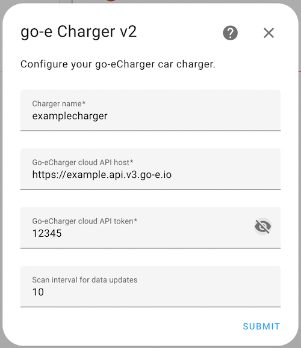

# Development

## Running the Home Assistant

If you have issues running VSCode `devcontainer`, there is a script to achieve live reloads of the custom component in the running Docker container.

Run:

```bash
./start-dev.sh
```

After few minutes, Home Assistant should be running and script should be in the watch mode. Whenever you change a file in the `custom_components/go_echarger` folder, it will restart the Home Assistant within a few seconds. Thus, you have a quick development feedback.

1. Open the <http://127.0.0.1:8123> in a browser.
2. Create an account.
3. You should see bunch of auto-created cards on the dashboard.

## Running the Home Assistant with HACS

In case you want to try HACS locally, run:

```
./start-local.sh
```

1. Open the <http://127.0.0.1:8123> in a browser.
2. Create an account - make sure that timezone is set correctly, otherwise it will fail to connect to the Github.
3. In the left menu you should have HACS icon, click it.
4. Click on `Integrations` -> click 3 dots top right corner -> click `Custom repositories`.
5. In the dialog window, add `https://github.com/openkfw/homeassistant_goechargerv2` as a repository and select `Integration` as a category.
6. Click `ADD`, wait for spinner to finish and close the dialog.
7. Click `EXPLORE & DOWNLOAD REPOSITORIES` -> search for `go-e` -> select the `go-e Charger v2` -> wait and click `DOWNLOAD`.
8. Go to Settings -> System -> click `RESTART` and wait few seconds.
9. Go to Settings -> Devices & Services. Click the `ADD INTEGRATION` button.
10. Search for `go-e Charger v2` -> click -> fill in details -> click `SUBMIT`.

Example config:



> Make sure that there is no trailing slash in the API host, otherwise the validation fails. When pressing submit, validation will also check the connectivity and fails if not able to connect and authenticate.

11. Go to the dashboard screen, you should see bunch of sensors for the Go-e Charger integration.

## Working with virtual env

It is highly recommended to work from within a virtual environment as especially dependencies can mess up quite easily.

Create:

```bash
python3 -m venv env
```

Activate:

```bash
source env/bin/activate
```

Deactivate:

```bash
deactivate
```

## Install required pip packages

```bash
python3 -m pip install -r requirements.txt
pre-commit install
```

## Uninstall all pip packages

In case you need to refresh your virtual environment, you can uninstall everything and the install again from scratch:

```bash
pip freeze | xargs pip uninstall -y
```

## Linting

Linting is done via [Pylint](https://www.pylint.org/).

```bash
pylint tests/**/*.py custom_components/**/*.py mock_api/**/*.py
```

## Formatting

Formatting is done via [Black](https://black.readthedocs.io/en/stable/getting_started.html).

```
black custom_components/go_echarger
```

To have autoformatting in the VSCode, install the extension `ms-python.black-formatter`.

## Unit testing

Unit testing is done via [Pytest](https://docs.pytest.org/en/7.2.x/).

```bash
pytest

# show logs
pytest -o log_cli=true

# code coverage
pytest --durations=10 --cov-report term-missing --cov=custom_components.go_echarger tests
```

> __Note: In case you have issues with bcrypt circular import, run this:__

```bash
python3 -m pip uninstall bcrypt -y && python3 -m pip install bcrypt
```
